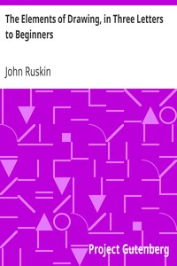

# The Elements of Drawing, in Three Letters to Beginners <kbd>30325</kbd>

## Authors

 - Ruskin, John <small>(1819 - 1900)</small>

## Subjects

 - Drawing

## Download

 - https://www.gutenberg.org/files/30325/30325-8.txt
 - https://www.gutenberg.org/cache/epub/30325/pg30325.cover.medium.jpg
 - https://www.gutenberg.org/files/30325/30325-h/30325-h.htm
 - https://www.gutenberg.org/files/30325/30325-8.zip
 - https://www.gutenberg.org/ebooks/30325.html.images
 - https://www.gutenberg.org/files/30325/30325.txt
 - https://www.gutenberg.org/ebooks/30325.txt.utf-8
 - https://www.gutenberg.org/ebooks/30325.rdf
 - https://www.gutenberg.org/ebooks/30325.epub.images
 - https://www.gutenberg.org/ebooks/30325.kindle.images

## Book Shelves

