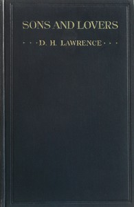

# Sons and Lovers <kbd>217</kbd>

## Authors

 - Lawrence, D. H. (David Herbert) <small>(1885 - 1930)</small>

## Subjects

 - Autobiographical fiction
 - Bildungsromans
 - Domestic fiction
 - England -- Fiction
 - Working class families -- Fiction
 - Young men -- Fiction

## Download

 - https://www.gutenberg.org/files/217/217-h/217-h.htm
 - https://www.gutenberg.org/files/217/217-h.zip
 - https://www.gutenberg.org/cache/epub/217/pg217.cover.medium.jpg
 - https://www.gutenberg.org/files/217/217.zip
 - https://www.gutenberg.org/ebooks/217.html.images
 - https://www.gutenberg.org/files/217/217-0.txt
 - https://www.gutenberg.org/ebooks/217.kindle.images
 - https://www.gutenberg.org/ebooks/217.rdf
 - https://www.gutenberg.org/ebooks/217.epub.images

## Book Shelves

 - Banned Books List from the American Library Association
 - Banned Books from Anne Haight's list
 - Best Books Ever Listings
