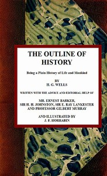

# The Outline of History: Being a Plain History of Life and Mankind <kbd>45368</kbd>

## Authors

 - Wells, H. G. (Herbert George) <small>(1866 - 1946)</small>

## Subjects

 - World history

## Download

 - https://www.gutenberg.org/files/45368/45368-0.txt
 - https://www.gutenberg.org/files/45368/45368-8.zip
 - https://www.gutenberg.org/files/45368/45368-h/45368-h.htm
 - https://www.gutenberg.org/files/45368/45368-0.zip
 - https://www.gutenberg.org/ebooks/45368.html.images
 - https://www.gutenberg.org/cache/epub/45368/pg45368.cover.medium.jpg
 - https://www.gutenberg.org/ebooks/45368.kindle.images
 - https://www.gutenberg.org/ebooks/45368.rdf
 - https://www.gutenberg.org/ebooks/45368.epub.images

## Book Shelves

 - Bestsellers, American, 1895-1923
