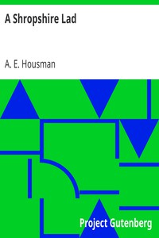

# A Shropshire Lad <kbd>5720</kbd>

## Authors

 - Housman, A. E. (Alfred Edward) <small>(1859 - 1936)</small>

## Subjects

 - Shropshire (England) -- Poetry

## Download

 - https://www.gutenberg.org/files/5720/5720.zip
 - https://www.gutenberg.org/files/5720/5720-h.zip
 - https://www.gutenberg.org/cache/epub/5720/pg5720.cover.small.jpg
 - https://www.gutenberg.org/files/5720/5720-h/5720-h.htm
 - https://www.gutenberg.org/ebooks/5720.html.images
 - https://www.gutenberg.org/ebooks/5720.kindle.images
 - https://www.gutenberg.org/ebooks/5720.rdf
 - https://www.gutenberg.org/ebooks/5720.epub.images
 - https://www.gutenberg.org/ebooks/5720.txt.utf-8

## Book Shelves

