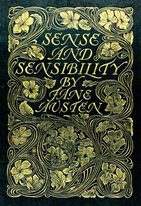

# Sense and Sensibility <kbd>161</kbd>

## Authors

 - Austen, Jane <small>(1775 - 1817)</small>

## Subjects

 - Domestic fiction
 - England -- Fiction
 - England -- Social life and customs -- 19th century -- Fiction
 - Gentry -- England -- Fiction
 - Inheritance and succession -- Fiction
 - Love stories
 - Mate selection -- Fiction
 - Regency fiction
 - Sisters -- Fiction
 - Social classes -- Fiction
 - Young women -- Fiction

## Download

 - https://www.gutenberg.org/cache/epub/161/pg161.cover.small.jpg
 - https://www.gutenberg.org/files/161/161-0.txt
 - https://www.gutenberg.org/files/161/161-0.zip
 - https://www.gutenberg.org/files/161/161-h/161-h.htm
 - https://www.gutenberg.org/ebooks/161.html.images
 - https://www.gutenberg.org/ebooks/161.kindle.images
 - https://www.gutenberg.org/ebooks/161.rdf
 - https://www.gutenberg.org/ebooks/161.epub.images

## Book Shelves

