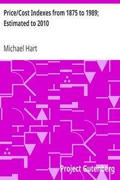

# Price/Cost Indexes from 1875 to 1989; Estimated to 2010 <kbd>88</kbd>

## Authors

 - Hart, Michael <small>(1947 - 2011)</small>

## Subjects

 - Cost and standard of living

## Download

 - https://www.gutenberg.org/files/88/88.zip
 - https://www.gutenberg.org/cache/epub/88/pg88.cover.medium.jpg
 - https://www.gutenberg.org/files/88/88.txt
 - https://www.gutenberg.org/ebooks/88.kindle.images
 - https://www.gutenberg.org/ebooks/88.html.images
 - https://www.gutenberg.org/ebooks/88.txt.utf-8
 - https://www.gutenberg.org/ebooks/88.rdf
 - https://www.gutenberg.org/ebooks/88.epub.images

## Book Shelves

