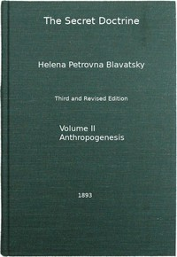

# The Secret Doctrine, Vol. 2 of 4: The Synthesis of Science, Religion, and Philosophy <kbd>54488</kbd>

## Authors

 - Blavatsky, H. P. (Helena Petrovna) <small>(1831 - 1891)</small>

## Subjects

 - Theosophy

## Download

 - https://www.gutenberg.org/files/54488/54488-0.zip
 - https://www.gutenberg.org/files/54488/54488-h.zip
 - https://www.gutenberg.org/files/54488/54488-tei.zip
 - https://www.gutenberg.org/ebooks/54488.html.images
 - https://www.gutenberg.org/cache/epub/54488/pg54488.cover.medium.jpg
 - https://www.gutenberg.org/files/54488/54488.txt
 - https://www.gutenberg.org/files/54488/54488-8.txt
 - https://www.gutenberg.org/ebooks/54488.rdf
 - https://www.gutenberg.org/ebooks/54488.epub.images
 - https://www.gutenberg.org/files/54488/54488-pdf.pdf
 - https://www.gutenberg.org/ebooks/54488.kindle.images
 - https://www.gutenberg.org/files/54488/54488-tei/54488-tei.tei

## Book Shelves

