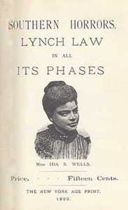

# Southern Horrors: Lynch Law in All Its Phases <kbd>14975</kbd>

## Authors

 - Wells-Barnett, Ida B. <small>(1862 - 1931)</small>

## Subjects

 - Lynching

## Download

 - https://www.gutenberg.org/cache/epub/14975/pg14975.cover.medium.jpg
 - https://www.gutenberg.org/files/14975/14975.zip
 - https://www.gutenberg.org/files/14975/14975-h/14975-h.htm
 - https://www.gutenberg.org/ebooks/14975.html.images
 - https://www.gutenberg.org/ebooks/14975.txt.utf-8
 - https://www.gutenberg.org/ebooks/14975.epub.images
 - https://www.gutenberg.org/ebooks/14975.rdf
 - https://www.gutenberg.org/ebooks/14975.kindle.images

## Book Shelves

 - African American Writers
 - Crime Nonfiction
