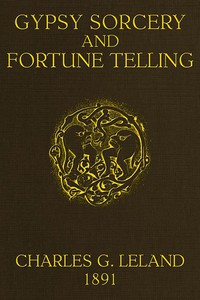

# Gypsy Sorcery and Fortune Telling: Illustrated by numerous incantations, specimens of medical magic, anecdotes and tales <kbd>58465</kbd>

## Authors

 - Leland, Charles Godfrey <small>(1824 - 1903)</small>

## Subjects

 - Fortune-telling
 - Magic, Romani
 - Romanies

## Download

 - https://www.gutenberg.org/files/58465/58465-h.zip
 - https://www.gutenberg.org/files/58465/58465-0.zip
 - https://www.gutenberg.org/ebooks/58465.html.images
 - https://www.gutenberg.org/cache/epub/58465/pg58465.cover.small.jpg
 - https://www.gutenberg.org/files/58465/58465-0.txt
 - https://www.gutenberg.org/ebooks/58465.txt.utf-8
 - https://www.gutenberg.org/ebooks/58465.rdf
 - https://www.gutenberg.org/ebooks/58465.kindle.images
 - https://www.gutenberg.org/ebooks/58465.epub.images

## Book Shelves

