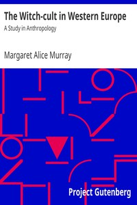

# The Witch-cult in Western Europe: A Study in Anthropology <kbd>20411</kbd>

## Authors

 - Murray, Margaret Alice <small>(1863 - 1963)</small>

## Subjects

 - Ethnology
 - Witchcraft -- Great Britain

## Download

 - https://www.gutenberg.org/files/20411/20411.zip
 - https://www.gutenberg.org/files/20411/20411-0.txt
 - https://www.gutenberg.org/cache/epub/20411/pg20411.cover.small.jpg
 - https://www.gutenberg.org/files/20411/20411-h/20411-h.htm
 - https://www.gutenberg.org/files/20411/20411-8.zip
 - https://www.gutenberg.org/files/20411/20411-8.txt
 - https://www.gutenberg.org/ebooks/20411.epub.images
 - https://www.gutenberg.org/ebooks/20411.rdf
 - https://www.gutenberg.org/ebooks/20411.kindle.images

## Book Shelves

 - Anthropology
 - Paganism
 - Witchcraft
