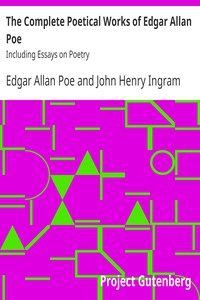

# The Complete Poetical Works of Edgar Allan Poe: Including Essays on Poetry <kbd>10031</kbd>

## Authors

 - Poe, Edgar Allan <small>(1809 - 1849)</small>

## Subjects

 - Fantasy poetry, American

## Download

 - https://www.gutenberg.org/files/10031/10031-h/10031-h.htm
 - https://www.gutenberg.org/cache/epub/10031/pg10031.cover.small.jpg
 - https://www.gutenberg.org/files/10031/10031-h.zip
 - https://www.gutenberg.org/ebooks/10031.txt.utf-8
 - https://www.gutenberg.org/files/10031/10031-0.txt
 - https://www.gutenberg.org/ebooks/10031.rdf
 - https://www.gutenberg.org/ebooks/10031.kindle.images
 - https://www.gutenberg.org/ebooks/10031.epub.images

## Book Shelves

