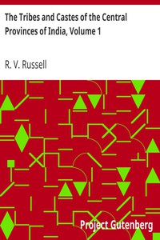

# The Tribes and Castes of the Central Provinces of India, Volume 1 <kbd>20583</kbd>

## Authors

 - Russell, R. V. (Robert Vane) <small>(1873 - 1915)</small>

## Subjects

 - Caste -- India -- Madhya Pradesh
 - Ethnology -- India -- Madhya Pradesh
 - Madhya Pradesh (India) -- Religion
 - Madhya Pradesh (India) -- Scheduled tribes

## Download

 - https://www.gutenberg.org/ebooks/20583.html.images
 - https://www.gutenberg.org/files/20583/20583.txt
 - https://www.gutenberg.org/files/20583/20583-8.txt
 - https://www.gutenberg.org/cache/epub/20583/pg20583.cover.medium.jpg
 - https://www.gutenberg.org/ebooks/20583.txt.utf-8
 - https://www.gutenberg.org/ebooks/20583.epub.images
 - https://www.gutenberg.org/ebooks/20583.rdf
 - https://www.gutenberg.org/ebooks/20583.kindle.images

## Book Shelves

