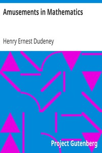

# Amusements in Mathematics <kbd>16713</kbd>

## Authors

 - Dudeney, Henry Ernest <small>(1857 - 1930)</small>

## Subjects

 - Mathematical recreations
 - Puzzles

## Download

 - https://www.gutenberg.org/files/16713/16713-8.txt
 - https://www.gutenberg.org/cache/epub/16713/pg16713.cover.medium.jpg
 - https://www.gutenberg.org/files/16713/16713.txt
 - https://www.gutenberg.org/files/16713/16713.zip
 - https://www.gutenberg.org/files/16713/16713-h/16713-h.htm
 - https://www.gutenberg.org/ebooks/16713.html.images
 - https://www.gutenberg.org/ebooks/16713.txt.utf-8
 - https://www.gutenberg.org/ebooks/16713.epub.images
 - https://www.gutenberg.org/ebooks/16713.rdf
 - https://www.gutenberg.org/ebooks/16713.kindle.images

## Book Shelves

