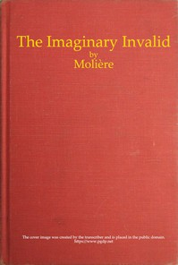

# The Imaginary Invalid <kbd>9070</kbd>

## Authors

 - Molière <small>(1622 - 1673)</small>

## Subjects

 - Comedies
 - Hypochondria -- Drama
 - Molière, 1622-1673 -- Translations into English

## Download

 - https://www.gutenberg.org/files/9070/9070-h.zip
 - https://www.gutenberg.org/cache/epub/9070/pg9070.cover.small.jpg
 - https://www.gutenberg.org/files/9070/9070-h/9070-h.htm
 - https://www.gutenberg.org/ebooks/9070.html.images
 - https://www.gutenberg.org/files/9070/9070-0.txt
 - https://www.gutenberg.org/ebooks/9070.kindle.images
 - https://www.gutenberg.org/ebooks/9070.rdf
 - https://www.gutenberg.org/ebooks/9070.epub.images

## Book Shelves

