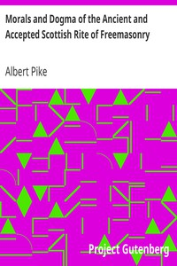

# Morals and Dogma of the Ancient and Accepted Scottish Rite of Freemasonry <kbd>19447</kbd>

## Authors

 - Pike, Albert <small>(1809 - 1891)</small>

## Subjects

 - Freemasons

## Download

 - https://www.gutenberg.org/files/19447/19447-0.zip
 - https://www.gutenberg.org/cache/epub/19447/pg19447.cover.small.jpg
 - https://www.gutenberg.org/files/19447/19447-0.txt
 - https://www.gutenberg.org/ebooks/19447.epub.images
 - https://www.gutenberg.org/ebooks/19447.html.images
 - https://www.gutenberg.org/ebooks/19447.rdf
 - https://www.gutenberg.org/ebooks/19447.kindle.images

## Book Shelves

