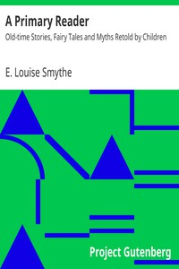

# A Primary Reader: Old-time Stories, Fairy Tales and Myths Retold by Children <kbd>7841</kbd>

## Authors

 - Smythe, E. Louise (Emma Louise) <small>(1858 - null)</small>

## Subjects

 - Children's literature
 - Fairy tales
 - Mythology, Classical -- Juvenile literature
 - Mythology, Norse -- Juvenile literature
 - Readers (Elementary)

## Download

 - https://www.gutenberg.org/files/7841/7841.zip
 - https://www.gutenberg.org/cache/epub/7841/pg7841.cover.small.jpg
 - https://www.gutenberg.org/files/7841/7841-h.zip
 - https://www.gutenberg.org/ebooks/7841.html.images
 - https://www.gutenberg.org/ebooks/7841.rdf
 - https://www.gutenberg.org/ebooks/7841.kindle.images
 - https://www.gutenberg.org/ebooks/7841.epub.images
 - https://www.gutenberg.org/ebooks/7841.txt.utf-8

## Book Shelves

 - Children's Instructional Books
 - Children's Myths, Fairy Tales, etc.
