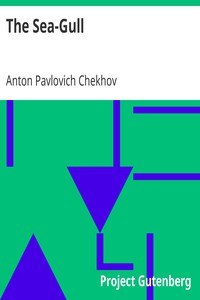

# The Sea-Gull <kbd>1754</kbd>

## Authors

 - Chekhov, Anton Pavlovich <small>(1860 - 1904)</small>

## Subjects

 - Authors, Russian -- 19th century -- Drama
 - Man-woman relationships -- Drama
 - Russia -- Social life and customs -- Drama
 - Russian drama -- Translations into English

## Download

 - https://www.gutenberg.org/files/1754/1754.zip
 - https://www.gutenberg.org/cache/epub/1754/pg1754.cover.medium.jpg
 - https://www.gutenberg.org/files/1754/1754-h.zip
 - https://www.gutenberg.org/files/1754/1754-0.txt
 - https://www.gutenberg.org/files/1754/1754.txt
 - https://www.gutenberg.org/ebooks/1754.html.images
 - https://www.gutenberg.org/ebooks/1754.rdf
 - https://www.gutenberg.org/ebooks/1754.epub.images
 - https://www.gutenberg.org/ebooks/1754.kindle.images

## Book Shelves

