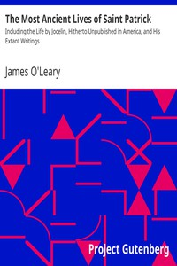

# The Most Ancient Lives of Saint Patrick: Including the Life by Jocelin, Hitherto Unpublished in America, and His Extant Writings <kbd>18482</kbd>

## Authors

## Subjects

 - Patrick, Saint, 373?-463?

## Download

 - https://www.gutenberg.org/files/18482/18482.txt
 - https://www.gutenberg.org/cache/epub/18482/pg18482.cover.medium.jpg
 - https://www.gutenberg.org/files/18482/18482-h.zip
 - https://www.gutenberg.org/files/18482/18482-h/18482-h.htm
 - https://www.gutenberg.org/files/18482/18482-8.txt
 - https://www.gutenberg.org/ebooks/18482.html.images
 - https://www.gutenberg.org/ebooks/18482.txt.utf-8
 - https://www.gutenberg.org/ebooks/18482.rdf
 - https://www.gutenberg.org/ebooks/18482.kindle.images
 - https://www.gutenberg.org/ebooks/18482.epub.images

## Book Shelves

