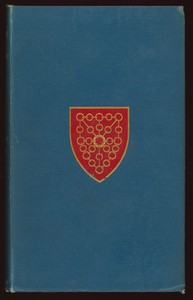

# The Tales of the Heptameron, Vol. 1 (of 5) <kbd>17701</kbd>

## Authors

 - Marguerite, Queen, consort of Henry II, King of Navarre <small>(1492 - 1549)</small>

## Subjects

 - Love stories, French -- Translations into English
 - Tales -- France -- Translations into English

## Download

 - https://www.gutenberg.org/files/17701/17701-0.txt
 - https://www.gutenberg.org/files/17701/17701.txt
 - https://www.gutenberg.org/files/17701/17701-8.zip
 - https://www.gutenberg.org/cache/epub/17701/pg17701.cover.small.jpg
 - https://www.gutenberg.org/files/17701/17701-8.txt
 - https://www.gutenberg.org/files/17701/17701-h/17701-h.htm
 - https://www.gutenberg.org/ebooks/17701.html.images
 - https://www.gutenberg.org/ebooks/17701.rdf
 - https://www.gutenberg.org/ebooks/17701.epub.images
 - https://www.gutenberg.org/ebooks/17701.kindle.images

## Book Shelves

