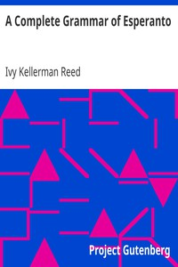

# A Complete Grammar of Esperanto <kbd>7787</kbd>

## Authors

 - Reed, Ivy Kellerman <small>(1877 - 1968)</small>

## Subjects

 - Esperanto -- Grammar

## Download

 - https://www.gutenberg.org/cache/epub/7787/pg7787.cover.small.jpg
 - https://www.gutenberg.org/files/7787/7787.zip
 - https://www.gutenberg.org/files/7787/7787-h.zip
 - https://www.gutenberg.org/files/7787/7787.txt
 - https://www.gutenberg.org/ebooks/7787.html.images
 - https://www.gutenberg.org/ebooks/7787.kindle.images
 - https://www.gutenberg.org/ebooks/7787.rdf
 - https://www.gutenberg.org/ebooks/7787.epub.images
 - https://www.gutenberg.org/ebooks/7787.txt.utf-8

## Book Shelves

 - Esperanto
 - Language Education
