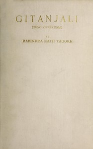

# Gitanjali <kbd>7164</kbd>

## Authors

 - Tagore, Rabindranath <small>(1861 - 1941)</small>

## Subjects

 - Bengali poetry -- Translations into English
 - Indic poetry -- Translations into English
 - Prose poems, Bengali -- Translations into English
 - Tagore, Rabindranath, 1861-1941 -- Translations into English

## Download

 - https://www.gutenberg.org/files/7164/7164-0.zip
 - https://www.gutenberg.org/files/7164/7164-h/7164-h.htm
 - https://www.gutenberg.org/files/7164/7164-0.txt
 - https://www.gutenberg.org/cache/epub/7164/pg7164.cover.medium.jpg
 - https://www.gutenberg.org/ebooks/7164.kindle.images
 - https://www.gutenberg.org/ebooks/7164.rdf
 - https://www.gutenberg.org/ebooks/7164.epub.images
 - https://www.gutenberg.org/ebooks/7164.txt.utf-8

## Book Shelves

