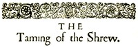

# The Taming of the Shrew <kbd>1508</kbd>

## Authors

 - Shakespeare, William <small>(1564 - 1616)</small>

## Subjects

 - Comedies
 - Man-woman relationships -- Drama
 - Married people -- Drama
 - Padua (Italy) -- Drama
 - Sex role -- Drama

## Download

 - https://www.gutenberg.org/files/1508/1508-h.zip
 - https://www.gutenberg.org/ebooks/1508.html.images
 - https://www.gutenberg.org/files/1508/1508-0.zip
 - https://www.gutenberg.org/cache/epub/1508/pg1508.cover.small.jpg
 - https://www.gutenberg.org/ebooks/1508.txt.utf-8
 - https://www.gutenberg.org/files/1508/1508-0.txt
 - https://www.gutenberg.org/ebooks/1508.rdf
 - https://www.gutenberg.org/ebooks/1508.epub.images
 - https://www.gutenberg.org/ebooks/1508.kindle.images

## Book Shelves

