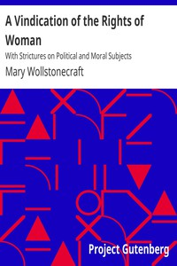

# A Vindication of the Rights of Woman: With Strictures on Political and Moral Subjects <kbd>3420</kbd>

## Authors

 - Wollstonecraft, Mary <small>(1759 - 1797)</small>

## Subjects

 - Feminism
 - Women -- Education -- Great Britain
 - Women -- History -- 19th century
 - Women's rights -- Great Britain

## Download

 - https://www.gutenberg.org/files/3420/3420.zip
 - https://www.gutenberg.org/cache/epub/3420/pg3420.cover.medium.jpg
 - https://www.gutenberg.org/files/3420/3420.txt
 - https://www.gutenberg.org/ebooks/3420.txt.utf-8
 - https://www.gutenberg.org/ebooks/3420.html.images
 - https://www.gutenberg.org/ebooks/3420.kindle.images
 - https://www.gutenberg.org/ebooks/3420.epub.images
 - https://www.gutenberg.org/ebooks/3420.rdf

## Book Shelves

 - Best Books Ever Listings
