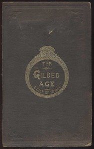

# The Gilded Age: A Tale of Today <kbd>3178</kbd>

## Authors

 - Twain, Mark <small>(1835 - 1910)</small>
 - Warner, Charles Dudley <small>(1829 - 1900)</small>

## Subjects

 - Businessmen -- Fiction
 - Legislators -- Fiction
 - Political corruption -- Fiction
 - Political fiction
 - Satire
 - Speculation -- Fiction
 - Washington (D.C.) -- Fiction

## Download

 - https://www.gutenberg.org/files/3178/3178-h.zip
 - https://www.gutenberg.org/cache/epub/3178/pg3178.cover.medium.jpg
 - https://www.gutenberg.org/files/3178/3178-0.txt
 - https://www.gutenberg.org/ebooks/3178.html.images
 - https://www.gutenberg.org/files/3178/3178-h/3178-h.htm
 - https://www.gutenberg.org/ebooks/3178.epub.images
 - https://www.gutenberg.org/ebooks/3178.rdf
 - https://www.gutenberg.org/ebooks/3178.kindle.images

## Book Shelves

