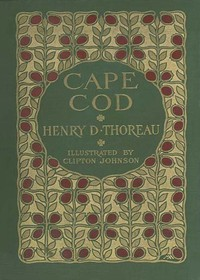

# Cape Cod <kbd>34392</kbd>

## Authors

 - Thoreau, Henry David <small>(1817 - 1862)</small>

## Subjects

 - Cape Cod (Mass.) -- Description and travel

## Download

 - https://www.gutenberg.org/files/34392/34392-h.zip
 - https://www.gutenberg.org/files/34392/34392-h/34392-h.htm
 - https://www.gutenberg.org/ebooks/34392.txt.utf-8
 - https://www.gutenberg.org/files/34392/34392-0.txt
 - https://www.gutenberg.org/cache/epub/34392/pg34392.cover.medium.jpg
 - https://www.gutenberg.org/ebooks/34392.epub.images
 - https://www.gutenberg.org/ebooks/34392.kindle.images
 - https://www.gutenberg.org/ebooks/34392.rdf

## Book Shelves

