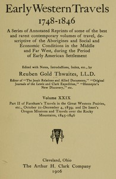

# Part II of Farnham's Travels in the Great Western Prairies, etc., October 21-December 4, 1839; and De Smet's Oregon Missions and Travels over the Rocky Mountains, 1845-1846 <kbd>67730</kbd>

## Authors

 - Farnham, Thomas Jefferson <small>(1804 - 1848)</small>
 - Smet, Pierre Jean de <small>(null - null)</small>

## Subjects

## Download

 - https://www.gutenberg.org/ebooks/67730.txt.utf-8
 - https://www.gutenberg.org/ebooks/67730.rdf
 - https://www.gutenberg.org/ebooks/67730.epub.images
 - https://www.gutenberg.org/ebooks/67730.kindle.images
 - https://www.gutenberg.org/files/67730/67730-0.zip
 - https://www.gutenberg.org/cache/epub/67730/pg67730.cover.medium.jpg
 - https://www.gutenberg.org/files/67730/67730-0.txt
 - https://www.gutenberg.org/files/67730/67730-h/67730-h.htm

## Book Shelves

