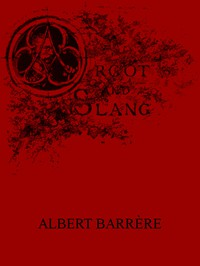

# Argot and Slang: A New French and English Dictionary of the Cant Words, Quaint Expressions, Slang Terms and Flash Phrases Used in the High and Low Life of Old and New Paris <kbd>50354</kbd>

## Authors

 - Barrère, Albert <small>(null - null)</small>

## Subjects

 - French language -- Dictionaries -- English
 - French language -- Slang -- Dictionaries

## Download

 - https://www.gutenberg.org/files/50354/50354-0.txt
 - https://www.gutenberg.org/cache/epub/50354/pg50354.cover.medium.jpg
 - https://www.gutenberg.org/ebooks/50354.html.images
 - https://www.gutenberg.org/files/50354/50354-h/50354-h.htm
 - https://www.gutenberg.org/ebooks/50354.rdf
 - https://www.gutenberg.org/ebooks/50354.epub.images
 - https://www.gutenberg.org/ebooks/50354.kindle.images

## Book Shelves

