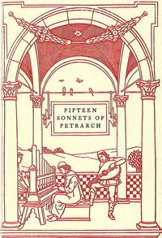

# Fifteen sonnets of Petrarch <kbd>50307</kbd>

## Authors

 - Petrarca, Francesco <small>(1304 - 1374)</small>

## Subjects

 - Italian poetry -- To 1400 -- Translations into English
 - Petrarca, Francesco, 1304-1374 -- Translations into English

## Download

 - https://www.gutenberg.org/cache/epub/50307/pg50307.cover.medium.jpg
 - https://www.gutenberg.org/files/50307/50307-8.txt
 - https://www.gutenberg.org/files/50307/50307-h.zip
 - https://www.gutenberg.org/ebooks/50307.html.images
 - https://www.gutenberg.org/files/50307/50307-h/50307-h.htm
 - https://www.gutenberg.org/ebooks/50307.txt.utf-8
 - https://www.gutenberg.org/ebooks/50307.rdf
 - https://www.gutenberg.org/ebooks/50307.epub.images
 - https://www.gutenberg.org/ebooks/50307.kindle.images

## Book Shelves

