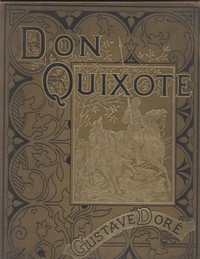

# Don Quixote <kbd>996</kbd>

## Authors

 - Cervantes Saavedra, Miguel de <small>(1547 - 1616)</small>

## Subjects

 - Knights and knighthood -- Spain -- Fiction
 - Picaresque literature
 - Romances
 - Spain -- Social life and customs -- 16th century -- Fiction

## Download

 - https://www.gutenberg.org/cache/epub/996/pg996.cover.small.jpg
 - https://www.gutenberg.org/ebooks/996.html.images
 - https://www.gutenberg.org/files/996/996-0.zip
 - https://www.gutenberg.org/files/996/996-0.txt
 - https://www.gutenberg.org/ebooks/996.txt.utf-8
 - https://www.gutenberg.org/ebooks/996.epub.images
 - https://www.gutenberg.org/ebooks/996.rdf
 - https://www.gutenberg.org/ebooks/996.kindle.images

## Book Shelves

 - Best Books Ever Listings
 - Harvard Classics
