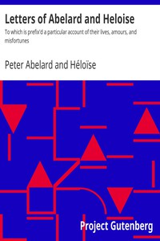

# Letters of Abelard and Heloise: To which is prefix'd a particular account of their lives, amours, and misfortunes <kbd>35977</kbd>

## Authors

 - Abelard, Peter <small>(1079 - 1142)</small>
 - Héloïse <small>(null - 1163)</small>

## Subjects

 - Abelard, Peter, 1079-1142 -- Correspondence
 - Authors, Latin (Medieval and modern) -- France -- Correspondence
 - Héloïse, approximately 1095-1163 or 1164 -- Correspondence
 - Love-letters

## Download

 - https://www.gutenberg.org/cache/epub/35977/pg35977.cover.medium.jpg
 - https://www.gutenberg.org/files/35977/35977.zip
 - https://www.gutenberg.org/files/35977/35977-h.zip
 - https://www.gutenberg.org/files/35977/35977-h/35977-h.htm
 - https://www.gutenberg.org/ebooks/35977.html.images
 - https://www.gutenberg.org/ebooks/35977.txt.utf-8
 - https://www.gutenberg.org/ebooks/35977.epub.images
 - https://www.gutenberg.org/ebooks/35977.rdf
 - https://www.gutenberg.org/ebooks/35977.kindle.images

## Book Shelves

