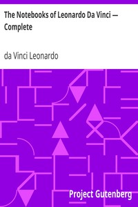

# The Notebooks of Leonardo Da Vinci — Complete <kbd>5000</kbd>

## Authors

 - Leonardo, da Vinci <small>(1452 - 1519)</small>

## Subjects

 - Leonardo, da Vinci, 1452-1519 -- Notebooks, sketchbooks, etc.

## Download

 - https://www.gutenberg.org/files/5000/5000-8.txt
 - https://www.gutenberg.org/files/5000/5000-8.zip
 - https://www.gutenberg.org/cache/epub/5000/pg5000.cover.small.jpg
 - https://www.gutenberg.org/ebooks/5000.html.images
 - https://www.gutenberg.org/ebooks/5000.kindle.images
 - https://www.gutenberg.org/ebooks/5000.rdf
 - https://www.gutenberg.org/ebooks/5000.epub.images

## Book Shelves

 - Art
