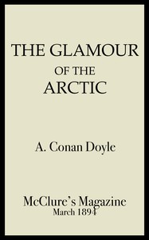

# The Glamour of the Arctic <kbd>67515</kbd>

## Authors

 - Doyle, Arthur Conan <small>(1859 - 1930)</small>

## Subjects

 - Arctic regions
 - Whaling

## Download

 - https://www.gutenberg.org/files/67515/67515-0.zip
 - https://www.gutenberg.org/files/67515/67515-h.zip
 - https://www.gutenberg.org/cache/epub/67515/pg67515.cover.small.jpg
 - https://www.gutenberg.org/files/67515/67515-h/67515-h.htm
 - https://www.gutenberg.org/ebooks/67515.rdf
 - https://www.gutenberg.org/ebooks/67515.txt.utf-8
 - https://www.gutenberg.org/ebooks/67515.epub.images
 - https://www.gutenberg.org/ebooks/67515.kindle.images
 - https://www.gutenberg.org/files/67515/67515-0.txt

## Book Shelves

