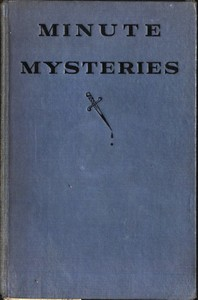

# Minute Mysteries [Detectograms] <kbd>50603</kbd>

## Authors

 - Ripley, H. A. (Harold Austin) <small>(1896 - null)</small>

## Subjects

 - Detective and mystery stories
 - Puzzles

## Download

 - https://www.gutenberg.org/cache/epub/50603/pg50603.cover.medium.jpg
 - https://www.gutenberg.org/files/50603/50603-0.zip
 - https://www.gutenberg.org/files/50603/50603-8.txt
 - https://www.gutenberg.org/ebooks/50603.html.images
 - https://www.gutenberg.org/files/50603/50603-0.txt
 - https://www.gutenberg.org/files/50603/50603-h/50603-h.htm
 - https://www.gutenberg.org/ebooks/50603.rdf
 - https://www.gutenberg.org/ebooks/50603.epub.images
 - https://www.gutenberg.org/ebooks/50603.kindle.images

## Book Shelves

