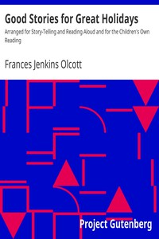

# Good Stories for Great Holidays: Arranged for Story-Telling and Reading Aloud and for the Children's Own Reading <kbd>359</kbd>

## Authors

 - Olcott, Frances Jenkins <small>(1872 - 1963)</small>

## Subjects

 - Children's literature
 - Holidays
 - Short stories
 - Storytelling

## Download

 - https://www.gutenberg.org/files/359/359-0.zip
 - https://www.gutenberg.org/files/359/359.zip
 - https://www.gutenberg.org/cache/epub/359/pg359.cover.medium.jpg
 - https://www.gutenberg.org/files/359/359-h/359-h.htm
 - https://www.gutenberg.org/ebooks/359.html.images
 - https://www.gutenberg.org/ebooks/359.kindle.images
 - https://www.gutenberg.org/ebooks/359.rdf
 - https://www.gutenberg.org/ebooks/359.epub.images

## Book Shelves

