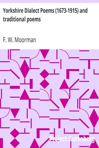

# Yorkshire Dialect Poems (1673-1915) and traditional poems <kbd>2888</kbd>

## Authors

 - Moorman, F. W. (Frederic William) <small>(1872 - 1919)</small>

## Subjects

 - Dialect poetry, English -- England -- Yorkshire
 - English language -- Dialects -- England -- Yorkshire
 - English literature -- England -- Yorkshire
 - English poetry -- England -- Yorkshire
 - Yorkshire (England) -- Languages -- History -- Sources
 - Yorkshire (England) -- Poetry

## Download

 - https://www.gutenberg.org/files/2888/2888-h.zip
 - https://www.gutenberg.org/files/2888/2888-8.zip
 - https://www.gutenberg.org/cache/epub/2888/pg2888.cover.medium.jpg
 - https://www.gutenberg.org/ebooks/2888.html.images
 - https://www.gutenberg.org/files/2888/2888.txt
 - https://www.gutenberg.org/files/2888/2888-8.txt
 - https://www.gutenberg.org/ebooks/2888.rdf
 - https://www.gutenberg.org/ebooks/2888.epub.images
 - https://www.gutenberg.org/ebooks/2888.kindle.images
 - https://www.gutenberg.org/ebooks/2888.txt.utf-8

## Book Shelves

 - United Kingdom
