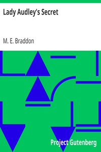

# Lady Audley's Secret <kbd>8954</kbd>

## Authors

 - Braddon, M. E. (Mary Elizabeth) <small>(1835 - 1915)</small>

## Subjects

 - Bigamy -- Fiction
 - Deception -- Fiction
 - Domestic fiction
 - England -- Fiction
 - Married women -- Fiction
 - Psychological fiction

## Download

 - https://www.gutenberg.org/cache/epub/8954/pg8954.cover.small.jpg
 - https://www.gutenberg.org/files/8954/8954-8.zip
 - https://www.gutenberg.org/files/8954/8954-h/8954-h.htm
 - https://www.gutenberg.org/files/8954/8954-8.txt
 - https://www.gutenberg.org/ebooks/8954.html.images
 - https://www.gutenberg.org/ebooks/8954.kindle.images
 - https://www.gutenberg.org/ebooks/8954.epub.images
 - https://www.gutenberg.org/ebooks/8954.rdf
 - https://www.gutenberg.org/ebooks/8954.txt.utf-8

## Book Shelves

