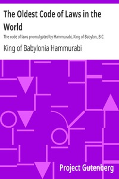

# The Oldest Code of Laws in the World: The code of laws promulgated by Hammurabi, King of Babylon, B.C. 2285-2242 <kbd>17150</kbd>

## Authors

 - Hammurabi, King of Babylonia <small>(null - null)</small>

## Subjects

 - Law -- Iraq -- Babylonia -- Sources

## Download

 - https://www.gutenberg.org/ebooks/17150.html.images
 - https://www.gutenberg.org/files/17150/17150.zip
 - https://www.gutenberg.org/cache/epub/17150/pg17150.cover.medium.jpg
 - https://www.gutenberg.org/ebooks/17150.txt.utf-8
 - https://www.gutenberg.org/ebooks/17150.epub.images
 - https://www.gutenberg.org/ebooks/17150.rdf
 - https://www.gutenberg.org/ebooks/17150.kindle.images

## Book Shelves

