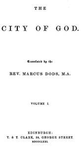

# The City of God, Volume I <kbd>45304</kbd>

## Authors

 - Augustine, Saint, Bishop of Hippo <small>(354 - 430)</small>

## Subjects

 - Apologetics -- Early works to 1800
 - Kingdom of God -- Early works to 1800

## Download

 - https://www.gutenberg.org/files/45304/45304-h/45304-h.htm
 - https://www.gutenberg.org/files/45304/45304-0.txt
 - https://www.gutenberg.org/files/45304/45304-8.zip
 - https://www.gutenberg.org/cache/epub/45304/pg45304.cover.medium.jpg
 - https://www.gutenberg.org/files/45304/45304.txt
 - https://www.gutenberg.org/ebooks/45304.html.images
 - https://www.gutenberg.org/ebooks/45304.kindle.images
 - https://www.gutenberg.org/ebooks/45304.rdf
 - https://www.gutenberg.org/ebooks/45304.epub.images

## Book Shelves

