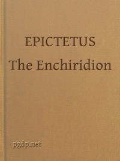

# The Enchiridion <kbd>45109</kbd>

## Authors

 - Epictetus <small>(55 - 135)</small>

## Subjects

 - Conduct of life -- Early works to 1800
 - Ethics, Ancient

## Download

 - https://www.gutenberg.org/files/45109/45109-h.zip
 - https://www.gutenberg.org/files/45109/45109.zip
 - https://www.gutenberg.org/files/45109/45109-h/45109-h.htm
 - https://www.gutenberg.org/files/45109/45109-0.txt
 - https://www.gutenberg.org/files/45109/45109-8.txt
 - https://www.gutenberg.org/cache/epub/45109/pg45109.cover.medium.jpg
 - https://www.gutenberg.org/ebooks/45109.html.images
 - https://www.gutenberg.org/ebooks/45109.kindle.images
 - https://www.gutenberg.org/ebooks/45109.rdf
 - https://www.gutenberg.org/ebooks/45109.epub.images

## Book Shelves

