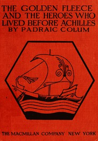

# The Golden Fleece and The Heroes Who Lived Before Achilles <kbd>37881</kbd>

## Authors

 - Colum, Padraic <small>(1881 - 1972)</small>

## Subjects

 - Argonauts (Greek mythology) -- Juvenile literature
 - Mythology, Greek -- Juvenile literature

## Download

 - https://www.gutenberg.org/files/37881/37881-tei.zip
 - https://www.gutenberg.org/files/37881/37881-h/37881-h.html
 - https://www.gutenberg.org/files/37881/37881-pdf.pdf
 - https://www.gutenberg.org/files/37881/37881-pdf.zip
 - https://www.gutenberg.org/files/37881/37881.zip
 - https://www.gutenberg.org/files/37881/37881-0.txt
 - https://www.gutenberg.org/cache/epub/37881/pg37881.cover.medium.jpg
 - https://www.gutenberg.org/files/37881/37881-8.txt
 - https://www.gutenberg.org/ebooks/37881.html.images
 - https://www.gutenberg.org/ebooks/37881.epub.images
 - https://www.gutenberg.org/ebooks/37881.rdf
 - https://www.gutenberg.org/ebooks/37881.kindle.images
 - https://www.gutenberg.org/files/37881/37881-tei/37881-tei.tei

## Book Shelves

