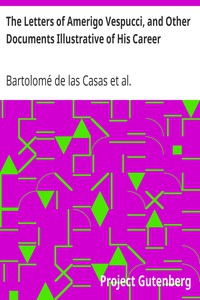

# The Letters of Amerigo Vespucci, and Other Documents Illustrative of His Career <kbd>36924</kbd>

## Authors

 - Columbus, Christopher <small>(1451 - 1506)</small>
 - Casas, Bartolomé de las <small>(1484 - 1566)</small>
 - Vespucci, Amerigo <small>(1451 - 1512)</small>

## Subjects

 - America -- Discovery and exploration -- Early works to 1800
 - Díaz de Solís, Juan, 1471?-1516?
 - Ojeda, Alonso de, approximately 1466-approximately 1515
 - Pinzón, Vicente Yáñez, 1461 or 1462-approximately 1524

## Download

 - https://www.gutenberg.org/cache/epub/36924/pg36924.cover.small.jpg
 - https://www.gutenberg.org/files/36924/36924-h.zip
 - https://www.gutenberg.org/files/36924/36924-h/36924-h.htm
 - https://www.gutenberg.org/files/36924/36924.zip
 - https://www.gutenberg.org/files/36924/36924-8.txt
 - https://www.gutenberg.org/ebooks/36924.html.images
 - https://www.gutenberg.org/ebooks/36924.kindle.images
 - https://www.gutenberg.org/ebooks/36924.txt.utf-8
 - https://www.gutenberg.org/ebooks/36924.epub.images
 - https://www.gutenberg.org/ebooks/36924.rdf

## Book Shelves

 - Travel
