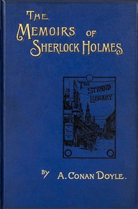

# The Memoirs of Sherlock Holmes <kbd>834</kbd>

## Authors

 - Doyle, Arthur Conan <small>(1859 - 1930)</small>

## Subjects

 - Detective and mystery stories, English
 - Holmes, Sherlock (Fictitious character) -- Fiction
 - Private investigators -- England -- Fiction

## Download

 - https://www.gutenberg.org/files/834/834-0.txt
 - https://www.gutenberg.org/files/834/834-0.zip
 - https://www.gutenberg.org/files/834/834-h/834-h.htm
 - https://www.gutenberg.org/ebooks/834.html.images
 - https://www.gutenberg.org/cache/epub/834/pg834.cover.medium.jpg
 - https://www.gutenberg.org/files/834/834-h/834-h.htm~
 - https://www.gutenberg.org/ebooks/834.kindle.images
 - https://www.gutenberg.org/ebooks/834.rdf
 - https://www.gutenberg.org/ebooks/834.epub.images

## Book Shelves

 - Detective Fiction
