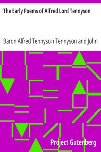

# The Early Poems of Alfred Lord Tennyson <kbd>8601</kbd>

## Authors

 - Tennyson, Alfred Tennyson, Baron <small>(1809 - 1892)</small>

## Subjects

 - English poetry -- 19th century

## Download

 - https://www.gutenberg.org/files/8601/8601-8.txt
 - https://www.gutenberg.org/files/8601/8601-h/8601-h.htm
 - https://www.gutenberg.org/files/8601/8601-0.zip
 - https://www.gutenberg.org/files/8601/8601.zip
 - https://www.gutenberg.org/cache/epub/8601/pg8601.cover.small.jpg
 - https://www.gutenberg.org/ebooks/8601.html.images
 - https://www.gutenberg.org/files/8601/8601-0.txt
 - https://www.gutenberg.org/ebooks/8601.kindle.images
 - https://www.gutenberg.org/ebooks/8601.epub.images
 - https://www.gutenberg.org/ebooks/8601.rdf

## Book Shelves

 - Arthurian Legends
