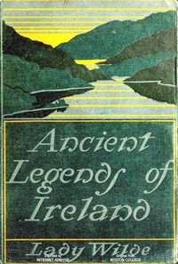

# Ancient legends, Mystic Charms & Superstitions of Ireland: With sketches of the Irish past <kbd>61436</kbd>

## Authors

 - Wilde, Lady <small>(1821 - 1896)</small>

## Subjects

 - Folklore -- Ireland
 - Legends -- Ireland

## Download

 - https://www.gutenberg.org/files/61436/61436-h.zip
 - https://www.gutenberg.org/files/61436/61436-0.zip
 - https://www.gutenberg.org/cache/epub/61436/pg61436.cover.medium.jpg
 - https://www.gutenberg.org/ebooks/61436.html.images
 - https://www.gutenberg.org/ebooks/61436.epub.images
 - https://www.gutenberg.org/ebooks/61436.rdf
 - https://www.gutenberg.org/ebooks/61436.kindle.images

## Book Shelves

