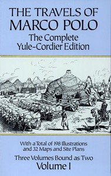

# The Travels of Marco Polo — Volume 1 <kbd>10636</kbd>

## Authors

 - Rustichello of Pisa <small>(null - null)</small>
 - Polo, Marco <small>(1254 - 1324)</small>

## Subjects

 - Asia -- Description and travel -- Early works to 1800
 - Mongols -- History
 - Polo, Marco, 1254-1323?
 - Voyages and travels

## Download

 - https://www.gutenberg.org/files/10636/10636-0.zip
 - https://www.gutenberg.org/files/10636/10636-h.zip
 - https://www.gutenberg.org/cache/epub/10636/pg10636.cover.medium.jpg
 - https://www.gutenberg.org/ebooks/10636.html.images
 - https://www.gutenberg.org/files/10636/10636-0.txt
 - https://www.gutenberg.org/ebooks/10636.txt.utf-8
 - https://www.gutenberg.org/ebooks/10636.epub.images
 - https://www.gutenberg.org/ebooks/10636.rdf
 - https://www.gutenberg.org/ebooks/10636.kindle.images

## Book Shelves

