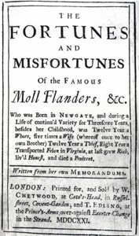

# The Fortunes and Misfortunes of the Famous Moll Flanders <kbd>370</kbd>

## Authors

 - Defoe, Daniel <small>(null - 1731)</small>

## Subjects

 - Adventure stories
 - British -- Virginia -- Fiction
 - Children of prisoners -- Fiction
 - Criminals -- Fiction
 - London (England) -- Fiction
 - Picaresque literature
 - Prostitutes -- Fiction
 - Repentance -- Fiction
 - Virginia -- Fiction
 - Women -- England -- Fiction

## Download

 - https://www.gutenberg.org/files/370/370-h.zip
 - https://www.gutenberg.org/cache/epub/370/pg370.cover.medium.jpg
 - https://www.gutenberg.org/ebooks/370.html.images
 - https://www.gutenberg.org/files/370/370-0.txt
 - https://www.gutenberg.org/ebooks/370.kindle.images
 - https://www.gutenberg.org/ebooks/370.rdf
 - https://www.gutenberg.org/ebooks/370.epub.images

## Book Shelves

