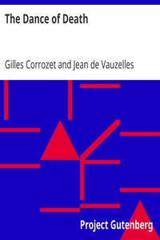

# The Dance of Death <kbd>21790</kbd>

## Authors

 - Vauzelles, Jean de <small>(null - null)</small>
 - Corrozet, Gilles <small>(1510 - 1568)</small>

## Subjects

 - Dance of death
 - Holbein, Hans, 1497-1543

## Download

 - https://www.gutenberg.org/files/21790/21790-h/21790-h.htm
 - https://www.gutenberg.org/cache/epub/21790/pg21790.cover.medium.jpg
 - https://www.gutenberg.org/files/21790/21790.zip
 - https://www.gutenberg.org/files/21790/21790-8.txt
 - https://www.gutenberg.org/files/21790/21790-8.zip
 - https://www.gutenberg.org/ebooks/21790.html.images
 - https://www.gutenberg.org/ebooks/21790.kindle.images
 - https://www.gutenberg.org/ebooks/21790.txt.utf-8
 - https://www.gutenberg.org/ebooks/21790.epub.images
 - https://www.gutenberg.org/ebooks/21790.rdf

## Book Shelves

