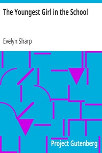

# The Youngest Girl in the School <kbd>32992</kbd>

## Authors

 - Sharp, Evelyn <small>(1869 - 1955)</small>

## Subjects

 - Boarding schools -- England -- Juvenile fiction
 - Girls -- Conduct of life -- Juvenile fiction
 - Schools -- Juvenile fiction
 - Students -- Social life and customs -- Juvenile fiction

## Download

 - https://www.gutenberg.org/files/32992/32992.txt
 - https://www.gutenberg.org/cache/epub/32992/pg32992.cover.small.jpg
 - https://www.gutenberg.org/files/32992/32992-8.txt
 - https://www.gutenberg.org/files/32992/32992-8.zip
 - https://www.gutenberg.org/files/32992/32992-h/32992-h.htm
 - https://www.gutenberg.org/ebooks/32992.html.images
 - https://www.gutenberg.org/ebooks/32992.txt.utf-8
 - https://www.gutenberg.org/ebooks/32992.epub.images
 - https://www.gutenberg.org/ebooks/32992.rdf
 - https://www.gutenberg.org/ebooks/32992.kindle.images

## Book Shelves

