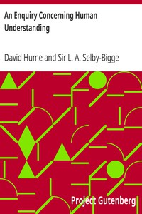

# An Enquiry Concerning Human Understanding <kbd>9662</kbd>

## Authors

 - Hume, David <small>(1711 - 1776)</small>

## Subjects

 - Ethics
 - Knowledge, Theory of

## Download

 - https://www.gutenberg.org/cache/epub/9662/pg9662.cover.small.jpg
 - https://www.gutenberg.org/files/9662/9662-h/9662-h.htm
 - https://www.gutenberg.org/files/9662/9662.zip
 - https://www.gutenberg.org/files/9662/9662-8.zip
 - https://www.gutenberg.org/ebooks/9662.html.images
 - https://www.gutenberg.org/files/9662/9662.txt
 - https://www.gutenberg.org/ebooks/9662.kindle.images
 - https://www.gutenberg.org/ebooks/9662.rdf
 - https://www.gutenberg.org/ebooks/9662.txt.utf-8
 - https://www.gutenberg.org/ebooks/9662.epub.images

## Book Shelves

 - Harvard Classics
 - Philosophy
