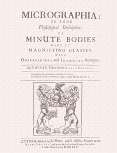

# Micrographia: Some Physiological Descriptions of Minute Bodies Made by Magnifying Glasses with Observations and Inquiries Thereupon <kbd>15491</kbd>

## Authors

 - Hooke, Robert <small>(1635 - 1703)</small>

## Subjects

 - Magnifying glasses -- Early works to 1800
 - Microscopy -- Early works to 1800
 - Natural history -- Pre-Linnean works

## Download

 - https://www.gutenberg.org/files/15491/15491-h/15491-h.htm
 - https://www.gutenberg.org/files/15491/15491-h.zip
 - https://www.gutenberg.org/cache/epub/15491/pg15491.cover.medium.jpg
 - https://www.gutenberg.org/files/15491/15491-0.txt
 - https://www.gutenberg.org/ebooks/15491.html.images
 - https://www.gutenberg.org/ebooks/15491.epub.images
 - https://www.gutenberg.org/ebooks/15491.rdf
 - https://www.gutenberg.org/ebooks/15491.kindle.images

## Book Shelves

 - Microscopy
